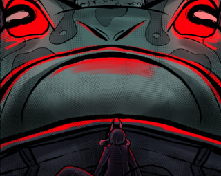
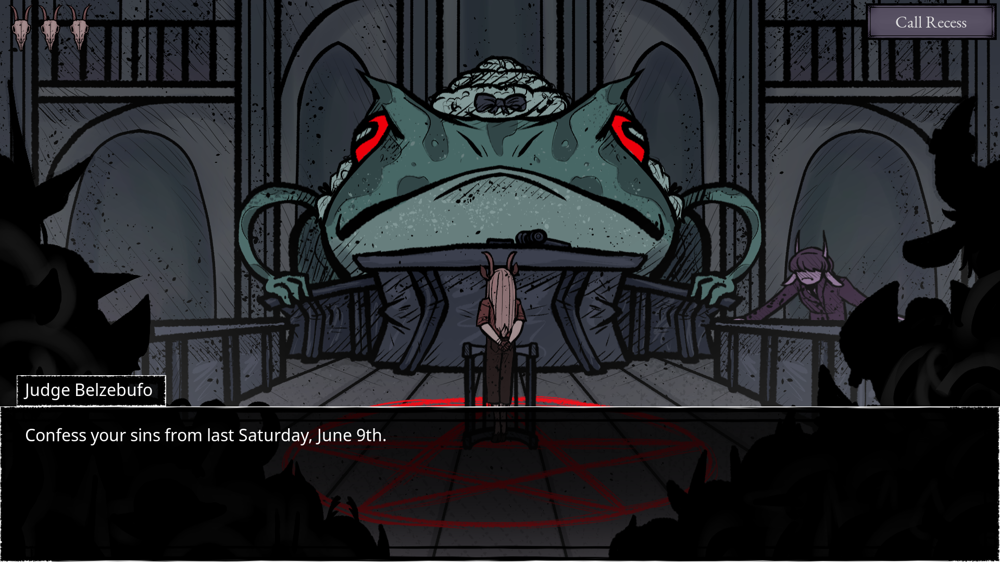
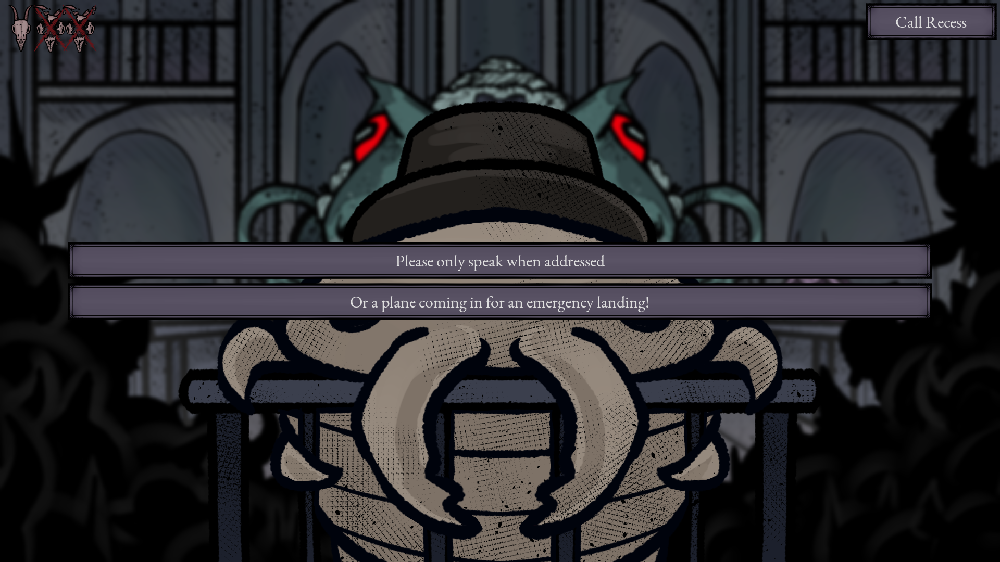

  
  <h3 align="center">Devil's Advocate - LD55</h3>

  

    You are the devil's advocate! Finesse your way through a hellish legal system as court-appointed counsel defending the indefensible.
  

  

    <a href="https://spectradev.itch.io/devilsadvocate">Play Online</a>
  

### About

Play as Jaya, a defense attorney in hell who is needing to get their newest client Abaddon out of serious punishment, except he's definitely guilty. Gaslight, gatekeep, and girlboss your way through "proving" his innocence so that Jaya can keep paying for their luxury condo.

Submitted as part of the [Ludum Dare 56 Jam](https://ldjam.com/events/ludum-dare/55/devils-advocate-1).

### Screenshots

   
   

### Controls

`Escape`: open and close pause menu

`Left Click (LMB)`: interact with interface and dialogue box

`Spacebar`: finish current dialogue line or skip to next line

### For macOS players

On Mac, Godot builds are broken in Chrome. Please use Safari (tested on Safari 17.4) or Firefox (right-click the game and select "This Frame -> Open Frame in New Tab").

### Changelog

- [x] Fixed Dialogue crash
- [x] Fixed Strike overflow crash
- [x] Fixed pause menu stuck during victory
- [x] Fixed Summoning skip

### Team Members

- [Sean Yang](https://github.com/s303824) - Programmer, Animator, Writer
- Kirill Tregubov - Programmer, Writer
- [KyoryuZain](https://kyoryuzain.itch.io/) - Artist, Graphic Designer
- [Jamail](https://jamail.itch.io/) - Composer
- [Caleb](https://rolinga101.itch.io/) - Sound Designer
